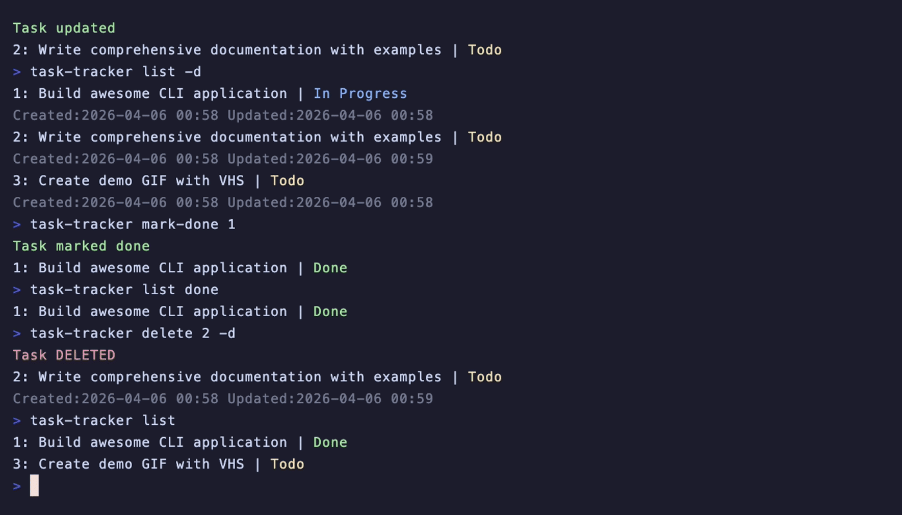

<div align="center">

# 📝 Task Tracker


**A simple and elegant command-line interface (CLI) application to manage your tasks**

Built with Python | Part of [Roadmap.sh Task Tracker Project](https://roadmap.sh/projects/task-tracker)

---



</div>

## ✨ Features

-  **Add, Update, Delete** - Full CRUD operations for task management
-  **Status Tracking** - Mark tasks as todo, in-progress, or done
-  **Task Filtering** - List all tasks or filter by specific status
-  **Persistent Storage** - All tasks saved automatically in JSON format
-  **Detailed View** - Optional detailed output showing timestamps for all operations
-  **Color-Coded Output** - Visual status indicators with color-coded terminal output

## 📋 Requirements

- Python 3.13 or higher
- No external dependencies required!

## 🚀 Installation

### Option 1: Install with pipx (Recommended)

Install globally using [pipx](https://pipx.pypa.io/):

```bash
pipx install git+https://github.com/IAmJafeth/task-tracker.git
```

Or install from local directory:

```bash
git clone https://github.com/IAmJafeth/task-tracker.git
cd task-tracker
pipx install .
```

### Option 2: Install with pip

Using a virtual environment (recommended):

```bash
git clone https://github.com/IAmJafeth/task-tracker.git
cd task-tracker
python -m venv .venv
source .venv/bin/activate  # On Windows: .venv\Scripts\activate
pip install -e .
```

### Option 3: Development Mode

For development or testing:

```bash
git clone https://github.com/IAmJafeth/task-tracker.git
cd task-tracker
pip install -e .  # Editable install
```

After installation, you can use the `task-tracker` command from anywhere!

## 💻 Usage

Run the task tracker from anywhere using:

```bash
task-tracker [command] [options]
```

Tasks are stored in `~/.task-tracker/tasks.json`

### 📚 Available Commands

#### Add a new task
```bash
task-tracker add "Task description"
task-tracker add "Task description" -d  # Show details after adding
```

#### List tasks
```bash
task-tracker list                    # List all tasks
task-tracker list todo               # List tasks with status "todo"
task-tracker list in-progress        # List tasks with status "in-progress"
task-tracker list done               # List tasks with status "done"
task-tracker list -d                 # List all tasks with details
```

#### Update a task
```bash
task-tracker update <task_id> "New description"
task-tracker update <task_id> "New description" -d  # Show details after updating
```

#### Delete a task
```bash
task-tracker delete <task_id>
task-tracker delete <task_id> -d  # Show details of deleted task
```

#### Mark task as in-progress
```bash
task-tracker mark-in-progress <task_id>
task-tracker mark-in-progress <task_id> -d  # Show details after marking
```

#### Mark task as done
```bash
task-tracker mark-done <task_id>
task-tracker mark-done <task_id> -d  # Show details after marking
```

### ⚙️ Options

| Option | Description |
|--------|-------------|
| `-d, --details` | Show detailed task information |
| `-v, --version` | Display the application version |
| `-h, --help` | Show help message |

### 📖 Examples

```bash
# Add a new task
task-tracker add "Buy groceries"

# List all tasks
task-tracker list

# Mark task 1 as in-progress
task-tracker mark-in-progress 1

# Update task 2
task-tracker update 2 "Buy groceries and cook dinner"

# Mark task 1 as done
task-tracker mark-done 1

# List only done tasks with details
task-tracker list done -d

# Delete task 3
task-tracker delete 3
```

## 📁 Project Structure

```
task-tracker/
├── task_tracker/        # Main package directory
│   ├── __init__.py      # Package initialization
│   ├── main.py          # Entry point and CLI command handlers
│   ├── parser.py        # Command-line argument parsing
│   ├── task.py          # Task dataclass and status enum
│   ├── tasklist.py      # TaskList class with task management operations
│   └── taskstorage.py   # JSON storage implementation with Protocol interface
├── tasks.json           # Legacy task data (for reference)
├── pyproject.toml       # Project metadata and build configuration
└── README.md            # This file
```

**Note:** After installation, tasks are stored in `~/.task-tracker/tasks.json` in your home directory.

## 🏗️ Architecture

The application follows clean architecture principles with clear separation of concerns:

- **Task**: Dataclass representing individual tasks with status management
- **TaskList**: Manages a collection of tasks with CRUD operations
- **TaskStorage Protocol**: Defines the interface for storage implementations
- **JsonTaskStorage**: Concrete implementation for JSON file persistence
- **Parser**: Handles command-line argument parsing
- **Main**: Orchestrates the application flow and user interactions

## 📄 License

This project is created as part of the Roadmap.sh project series.

## 🔗 Links

- **Project Page:** [Roadmap.sh Task Tracker](https://roadmap.sh/projects/task-tracker)
- **Repository:** [GitHub](https://github.com/IAmJafeth/task-tracker)

---

<div align="center">

Made with ❤️ as part of the [Roadmap.sh](https://roadmap.sh) project series

</div>
